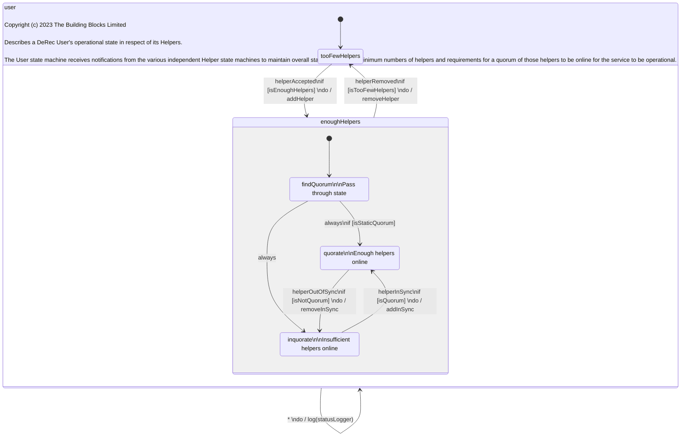

```mermaid
%% Generated with Stately Studio
stateDiagram-v2
  state "user\n\nCopyright (c) 2023 The Building Blocks Limited\n\nDescribes a DeRec User's operational state in respect of its Helpers.\n\nThe User state machine receives notifications from the various independent Helper state machines to maintain overall state in respect of minimum numbers of helpers and requirements for a quorum of those helpers to be online for the service to be operational." as user {
    [*] --> user.tooFewHelpers
    user.tooFewHelpers --> user.enoughHelpers : helperAccepted\nif [isEnoughHelpers] \ndo / addHelper
    user.enoughHelpers --> user.tooFewHelpers : helperRemoved\nif [isTooFewHelpers] \ndo / removeHelper
    state "tooFewHelpers" as user.tooFewHelpers
        state "enoughHelpers" as user.enoughHelpers {
            [*] --> user.enoughHelpers.findQuorum
            user.enoughHelpers.findQuorum --> user.enoughHelpers.quorate : always\nif [isStaticQuorum]
            user.enoughHelpers.findQuorum --> user.enoughHelpers.inquorate : always
            user.enoughHelpers.quorate --> user.enoughHelpers.inquorate : helperOutOfSync\nif [isNotQuorum] \ndo / removeInSync
            user.enoughHelpers.inquorate --> user.enoughHelpers.quorate : helperInSync\nif [isQuorum] \ndo / addInSync
            state "findQuorum\n\nPass through state" as user.enoughHelpers.findQuorum
            state "quorate\n\nEnough helpers online" as user.enoughHelpers.quorate
            state "inquorate\n\nInsufficient helpers online" as user.enoughHelpers.inquorate
        }
  }

  user --> user : createHelper\nif [isValidNewHelper] \ndo / createHelper
  user --> user : createHelper \ndo / newHelperInvalid
  user --> user : helperInSync\nif [isValidOnlineHelperEvent] \ndo / addInSync
  user --> user : helperOutOfSync\nif [isValidOfflineHelperEvent] \ndo / removeInSync
  user --> user : helperAccepted\nif [isValidAddHelperEvent] \ndo / addHelper
  user --> user : helperRemoved\nif [isValidRemoveHelperEvent] \ndo / removeHelper
  user --> user : * \ndo / log(statusLogger)
```
